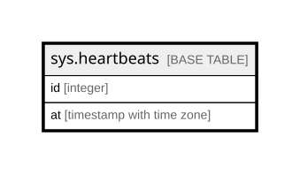

# sys.heartbeats

## Columns

| Name | Type | Default | Nullable | Children | Parents | Comment |
| ---- | ---- | ------- | -------- | -------- | ------- | ------- |
| id | integer |  | false |  |  |  |
| at | timestamp with time zone | now() | false |  |  |  |

## Constraints

| Name | Type | Definition |
| ---- | ---- | ---------- |
| heartbeats_at_not_null | n | NOT NULL at |
| heartbeats_id_not_null | n | NOT NULL id |
| heartbeats_pkey | PRIMARY KEY | PRIMARY KEY (id) |

## Indexes

| Name | Definition |
| ---- | ---------- |
| heartbeats_pkey | CREATE UNIQUE INDEX heartbeats_pkey ON sys.heartbeats USING btree (id) |

## Relations

---

> Generated by [tbls](https://github.com/k1LoW/tbls)
